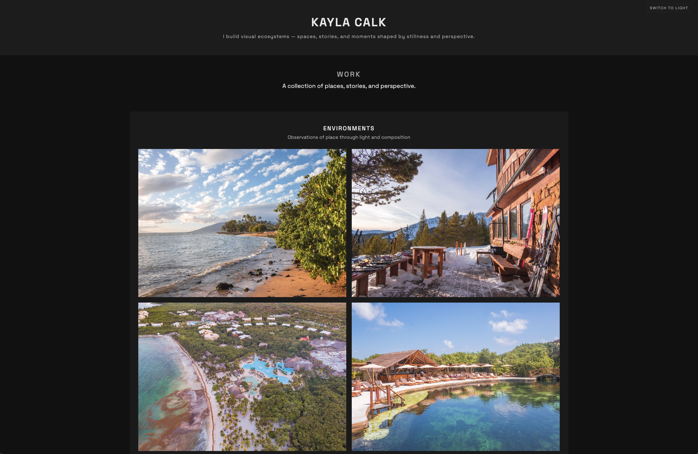
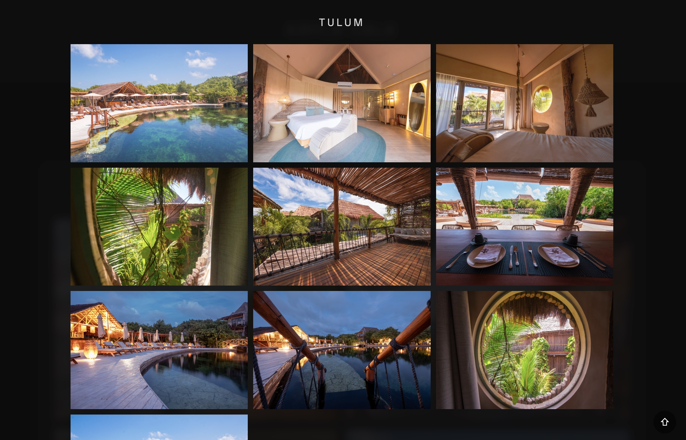

# Kayla Calk

Visual ecosystems — spaces, stories, and moments shaped by stillness and perspective.

---

## Overview

This is a curated portfolio of photographic and cinematic work exploring environment, narrative, and form.  
Each project is approached as a study in presence — how light, movement, and composition shape perception.

---

## Work

### Environments  
Observations of place through light, texture, and spatial composition.

### Narratives  
Story-driven work across film and image — including concept films, voice-led landscapes, and interviews.

### Studies  
Explorations of form, direction, and transformation — from multi-day visual studies to brand and spatial work.

---

## Experience

The site is designed as an immersive viewing experience:
- Minimal interface to prioritize visual clarity  
- Progressive image loading with subtle fade transitions  
- Lightbox navigation with swipe, click, and keyboard controls  
- Responsive behavior across desktop, tablet, and mobile  

---

## Live Site

[View Portfolio](https://kaylaprojects.com)

---

## Preview

---

## License

© 2026 Kayla Calk. All rights reserved.

All content, including but not limited to photographs, videos, text, design, and code within this repository, is the intellectual property of the author and may not be copied, reproduced, modified, distributed, or used to create derivative works without prior written permission.
